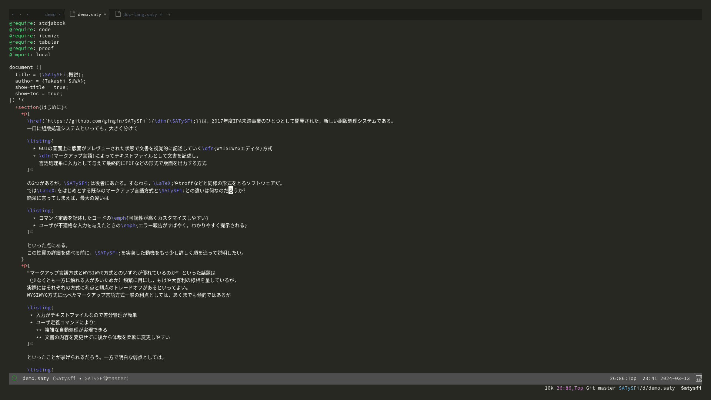

# satysfi-ts-mode

A tree-sitter based major-mode for SATySFi

> [!NOTE]
> This package is based on Emacs 29's built-in [`treesit`](treesit) and `c-ts-common` features.
> `satysfi-ts-mode` was tested on [5519c54](https://github.com/monaqa/tree-sitter-satysfi/commit/5519c547418ecb31ac7d63e64653aed726b5d1c3) in [tree-sitter-satysfi](https://github.com/monaqa/tree-sitter-satysfi).

## Difference
Compared to [satysfi-mode](https://github.com/gfngfn/satysfi.el), it is superior in the following ways: 
- Indentation
  Relatively good.
- Syntax Highlighting
  In satysfi-mode, the color theme was not reflected for syntax highlighting, but this major mode reflects color theme colors based on tree-sitter.

## image
satysfi-mode <- -> satysfi-ts-mode

